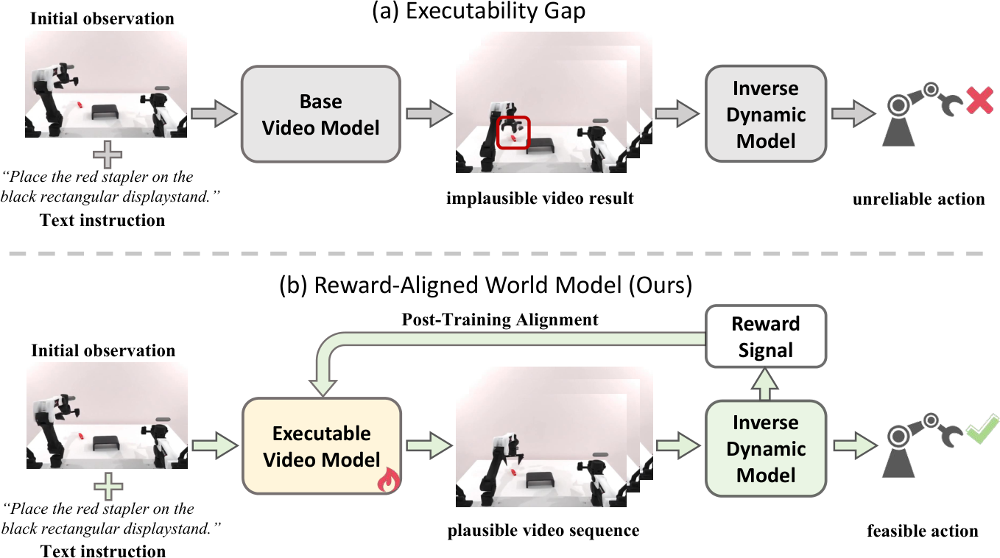

# EVA: Aligning Video World Models with Executable Robot Actions via Inverse Dynamics Rewards

  <a href="https://eva-project-page.github.io/">🌐 Project Page</a>

## Overview

EVA is a post-training framework for aligning video world models with **physically executable robot actions**.

Recent work explores video generative models as visual planners for robotic manipulation. However, these models often produce rollouts that violate rigid-body and kinematic consistency, producing unstable or infeasible control commands when decoded by an IDM. We refer to this mismatch between visual generation and physically executable control as the _executability gap_.

In this paper, we leverage the executability gap as a training signal and introduce **Executable Video Alignment (EVA)**, a reinforcement-learning post-training framework for aligning video world models. EVA trains an inverse dynamics model on real robot trajectories and repurposes it as a reward model that evaluates generated videos through the action sequences they induce, encouraging smooth motions measured by velocity, acceleration, and jerk while penalizing actions that violate embodiment constraints.

## Main Figure

  

## Status

This repository is under active development.

We are preparing the public release of:
- training code
- evaluation pipeline
- pretrained checkpoints

---

## Planned Release

- [ ] Pretrained checkpoints  
- [ ] Inference and evaluation code  
- [ ] Post-training pipeline  

---

